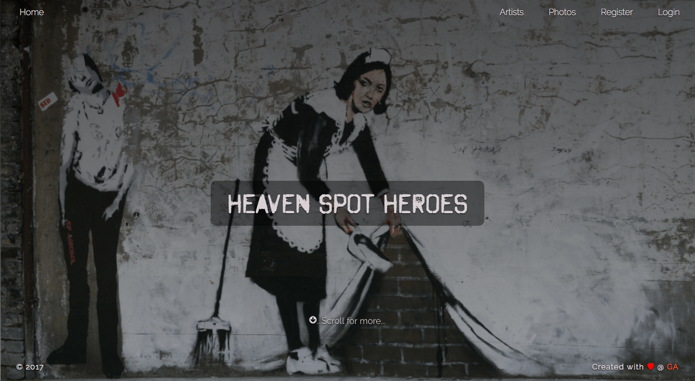
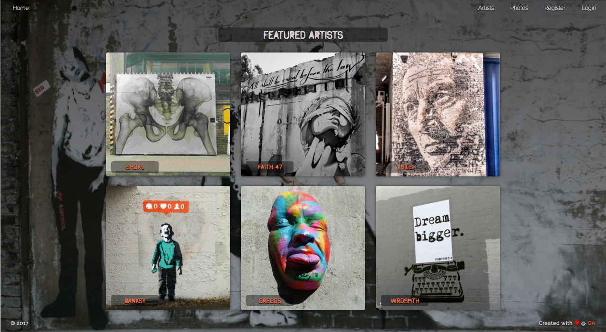
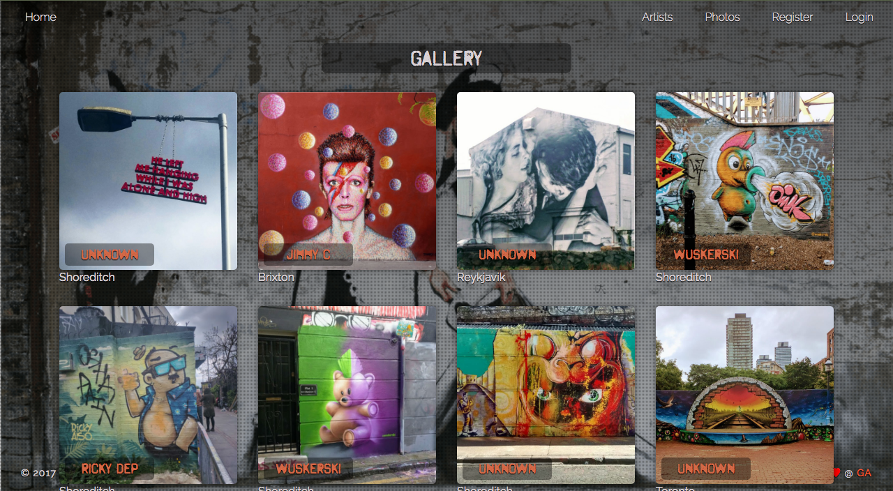

# GA WDI 29 London: Project 2

## Heaven Spot Heroes

*Check it out here.* [Check it out here!](https://heaven-spot-heroes.herokuapp.com/)

### Introduction

This app was made over a 5 day period. The project required to create an Express JS app, with MongoDb, using authentication, the 'CRUD' operations, and RESTful routing. We were also to use a frontend framework. I decided to use Bootstrap 4. In the project I created 5 models. Two to fill information and photos for the homepage, and a model for Artists, a Photo Gallery, and for a User. It was really interesting to have some time to put to use all that we have learned in this section.

### The app

I love Street Art, and thought it could be interesting to make an app that could allow users to post photos, edit information, and comment on what others have shared. I feel I accomplished what I had set out to do with my design and look forward to working on the app moving forward

### Challenges

The challenges I faced in this project were putting my design ideas into implementation. I spent some time becoming familiar with Bootstrap 4, as previously I had used Bootstrap 4. Another issue was being organised with all of the files and directories.

### Moving Forward

I am excited to add more features to the app in the future. It will be nice to add user's name to their comments, create a like button for photos, have a mapping system that shows where the items are located, and an internal messaging system for the users.
